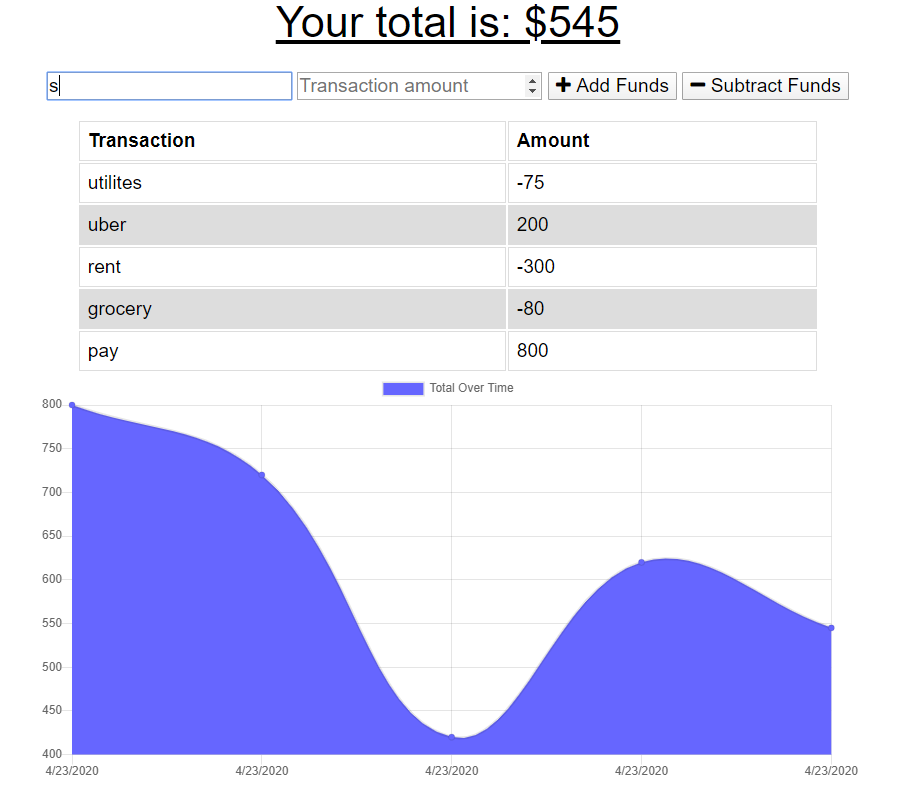

# Budget-Tracker

A budget Tracker application available for online and offline use!

# User Story

Allows and individual to track his spending and see where and what they are spending most of their funds on.

[Try it yourself!](https://budget-tracker-g.herokuapp.com/)

# Local Installation and Use:

This app requires both node.js and MondoDB  
 Clone the repo then navigate to the root folder  
 Run ### `npm i` to install any necessary packages  
 Finally, run the server with command ### `node ..`

# Build With

- Mongoose
- MongoDB
- Webpack
- Express
- Node.js
- HTML
- CSS
- Javascript
